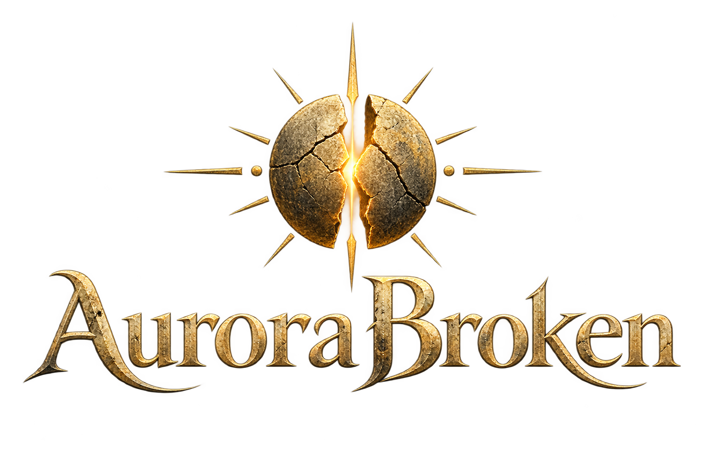
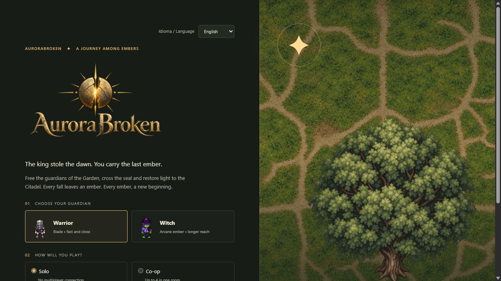
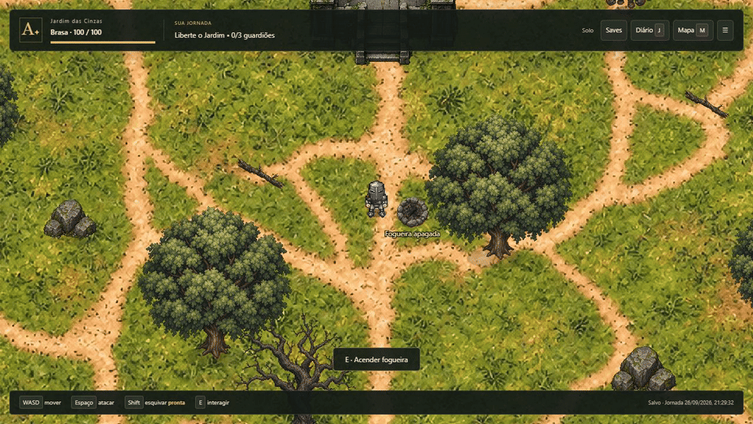
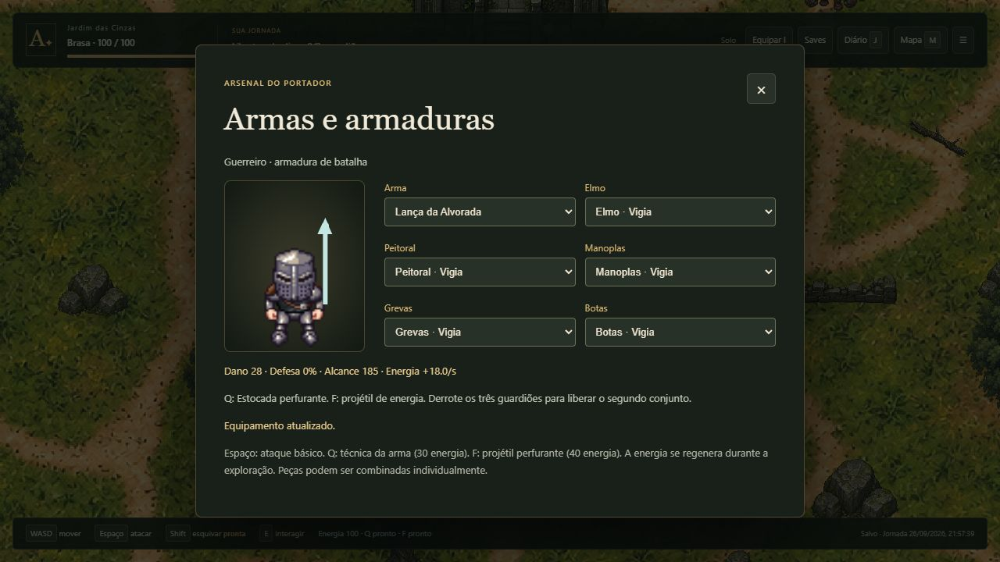
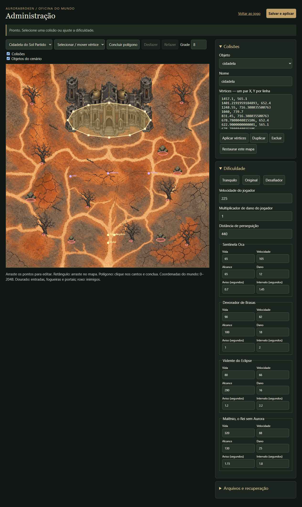

# AuroraBroken



A top-down action RPG with a solo campaign and optional co-op for up to four players. Available in **English and Brazilian Portuguese**: use **Idioma / Language** in the main menu. Your choice is remembered by this browser and can be changed during a campaign without resetting progress. Players in the same room can use different languages.





*Actual gameplay capture. The GIF repeats the demonstration; the bonfire stays lit in the campaign. Older screenshots and the GIF show the Portuguese interface.*

## Run locally

Install [Node.js](https://nodejs.org/) and run these commands from the project root:

```sh
npm run install-all
npm start
```

Open [localhost:3000](http://localhost:3000). The same server serves the game and Socket.IO; no separate client server is required. With dependencies already installed, just run `npm start`.

`npm run dev` restarts the server when files change. Reload the browser after editing client code. `npm test` runs the automated tests.

## Controls and progression

- **WASD / Arrow keys:** move. **Space:** attack in the direction you face.
- **Shift:** dodge with brief invulnerability; 1.2-second cooldown.
- **E:** interact with nearby bonfires, portals, inscriptions and runes.
- **R:** respawn after falling. **I:** weapons and armor.
- **Q:** weapon technique; 30 energy, 4-second cooldown.
- **F:** piercing energy projectile; 40 energy, 3-second cooldown.
- **J:** journal and bestiary. **M:** objective map. **Esc:** main menu. **F3:** collision overlay.
- Movement and action buttons appear automatically on touch devices.

Attacks cannot pass through solid obstacles. Enemy circles warn you where damage will land. Malênio and the Warden become enraged below half health.

Defeat the three guardians in the **Garden of Ash** to open its northern portal. The **Citadel of the Shattered Sun** has a return portal to the south. Defeat Malênio, then enter the castle through the portal by its facade.

The third stage, **Crypt of the First Dawn**, contains seven enemies, including Crypt Shades and the Warden boss. Read the inscription with E and activate the three runes in the indicated order to open the northern chamber. Defeat the Warden to complete the story.

Defeated enemies stay defeated when you change maps. Respawning resets surviving enemies on the map where you died only when no other living player is fighting there.

## Weapons and armor

The Warrior can equip a sword, spear or axe. The Witch can equip a staff, wand or grimoire. Each weapon has its own damage, reach, attack angle and cooldown: spears deliver long thrusts, axes trade speed for impact, wands focus rapid attacks, and grimoires strike around the caster.

Q uses the equipped weapon's technique: Whirlwind, Piercing Thrust, Seismic Rupture, Arcane Nova, Focused Beam or Solar Circle. Techniques deal double damage and slow enemies for two seconds. F launches energy that can pierce several enemies but stops at walls and the closed dungeon seal.

Equip **helmet/hood, chestplate/robe, gloves/gauntlets, greaves/leggings and boots** individually, plus your weapon. Each class has three armor sets:

- **Warrior:** Sentry, Solar Iron, Dawn Guardian.
- **Witch:** Apprentice, Eclipse Weaver, Dawn Oracle.

Clear the Garden to unlock the second set and defeat Malênio to unlock the third. Mix pieces in **Equipment · I**. The screen shows damage, defense, energy regeneration and appearance. Armor colors are applied to regions of the animated character sprite, and the weapon appears in the character's hand. Defense reduces incoming damage; better pieces also increase attack power and, for some sets, energy regeneration.

Every co-op player has separate equipment, validated by the server and saved with their profile.



## Bonfires

Each map starts with an unlit bonfire. Approach it and press **E** to light it once per campaign. It restores health, makes the nearby area safe and sets your respawn checkpoint. Afterward, E lets you rest with an eight-second cooldown.

The lit state is shared by the room; each player records their own checkpoint by interacting. Bonfires and checkpoints persist through saves, exports and server restarts. Saves from before the bonfire system start with unlit fires; existing fires are preserved when upgrading to the dungeon expansion.

## Solo saves

Solo is the default mode and does not load or connect Socket.IO. Progress is saved in browser storage every two seconds and when leaving the page. Each **Start a new journey** creates a separate save.

In **Files and saves**, select, rename, load, save manually, export JSON or import a campaign. Importing creates a new entry, preserving previous campaigns. Autosave only updates the active campaign. Older saves are migrated automatically; player names and custom save names are preserved when switching languages.

## Co-op and networking

Choose **Co-op**, enter the same room code on all computers, and use different player names. Battles, bosses, bonfires and puzzle progress are shared. Characters on different maps do not appear together. The server accepts input commands, never client-supplied positions or damage. Each room supports up to four participants.

The server listens on `0.0.0.0:3000` for LAN play. Use [localhost:3000](http://localhost:3000) on the host PC. On another PC on the same network, use the LAN address shown in the Co-op menu. `localhost` on the other PC refers to that computer, not the host. `HOST` and `PORT` configure the listening interface and port. The host must stay on with `npm start` running.

For remote play through an HTTP tunnel such as ngrok, share its HTTPS address and use the same room code. WebSocket traffic uses the page's own origin. Stopping the tunnel disables that public address; it does not stop local play. The admin API remains restricted to localhost.

### Multiplayer saves

Rooms save every five seconds, on manual save, when players leave and during normal server shutdown. Separate files are stored in `saves/multiplayer/ROOM-CODE.json`, with the previous version in `.json.bak`. The server restores rooms after restarting.

A random browser identifier, scoped to the room and player name, restores the player profile. Use the same browser and site address to keep that identity. If the connection drops, reconnect through the menu. The old profile is preserved.

Any participant can save or export the room. Only its creator, alone in the room, can import a multiplayer file. A permanent pre-import backup is saved under `saves/multiplayer/backups/`. To restore on another server or after losing the creator's browser identity, create a new room and import the file. Use another room code for a separate campaign.

Saves are outside the public client directory and excluded from Git. Set `SAVE_DIR` to use another server save directory.

## Layered scenery and depth

All three maps use ground-only images: `ground-garden.png`, `ground-ash.png` and `ground-dungeon.png`. Trees, dead trees, rocks, branches, barriers, the shrine and the castle are separate transparent PNGs. The Garden has 62 scenery objects and the Citadel has 59, including perimeter trees, extra rocks and ruined barriers. The crypt has 15 objects and a wall separating its chambers, with a central passage controlled by the puzzle.

Rendering order is ground, low branches and shadows, then tall objects and actors sorted by their feet's Y position. Walking north of a tree places the character behind its canopy; walking south places the character in front. Only the trunk's base blocks movement. Enemies follow the same visual rules in solo and co-op.

`client/scenery.mjs` defines each object's type, position, width, ground anchor and collision footprint. Edit `SCENERY` to place objects and `PROP_TYPES` to adjust dimensions. The admin editor shows props over the ground, with a toggle to hide them. Editing collision polygons does not move the artwork.

Active ground textures are **1254 × 1254** pixels. Each logical map is **2048 × 2048** world units; collision geometry is independent of image resolution. Older map artwork is kept only as reference. Fallen branches are decorative.

## Administration

Open [localhost:3000/admin.html](http://localhost:3000/admin.html) on the server PC or follow the main menu link. Administration is not available over LAN or a public tunnel. The editor's interface is currently in Portuguese; the game's language selector covers the player interface.

- Select a map and an obstacle. Drag vertices, move the entire polygon or edit exact coordinates. The rectangle tool creates a shape by dragging; the polygon tool accepts corner clicks and finishes with the finish-polygon button.
- Use the grid and collision overlay to compare geometry with the art. Duplicate or delete shapes. To add or remove vertices, edit the X/Y lines and apply them.
- Undo/Redo restores local edits. Reset one map or all defaults, export/import JSON, or discard changes.
- Adjust each enemy's health, speed, damage, range, windup and attack interval. Global settings include player speed, player damage multiplier and pursuit distance, plus Easy, Original and Challenging presets.
- Save and apply publishes changes immediately to co-op; solo checks every five seconds. Dead enemies remain dead, and living enemies retain their remaining health percentage.

The server rejects out-of-range values, self-intersecting or zero-area polygons, and obstacles covering entrances, bonfires, portals, runes or enemy spawn points. Settings persist in `config/world-settings.json`, with the previous version in `.json.bak`. `SETTINGS_DIR` selects a different configuration directory. To recover a backup, copy it to a `.json` file, import it in the editor and save. Concurrent edits are rejected to avoid overwriting another admin session.



## Project structure

- `client/world.mjs`: maps, portals, enemy types and spawn points. Actor positions represent the center of their feet.
- `client/scenery.mjs`: prop placement, collision footprints and depth ordering.
- `client/engine.mjs`: simulation shared by solo and co-op, using 1/60-second steps; includes combat, projectiles and the rune puzzle.
- `client/equipment.mjs`: weapons, class-specific armor sets, stats and unlocks.
- `client/app.mjs`, `style.css`, `index.html`: rendering, controls, menus and story. `game.js` is the entry point.
- `client/i18n.mjs`: English translations, Portuguese fallback, browser language preference and player UI localization. Shared world state stays language-independent.
- `client/save.mjs`, `save-library.mjs`: versioned solo saves and separate browser campaigns.
- `api/server.js`, `room-store.mjs`: static hosting, authoritative rooms, input validation, 20 Hz snapshots and persistent multiplayer saves.
- `client/settings.mjs`: shared collision and difficulty validation.
- `client/admin.html`, `admin.mjs`, `admin.css`: visual editor.
- `api/admin.mjs`: localhost access control and settings persistence.
- `client/collisions.json`: legacy Tiled geometry, kept as reference. Active footprints come from `scenery.mjs` with admin edits applied by `settings.mjs`.
- `docs/`: gameplay GIF and screenshots.

The six enemy types use generated top-down images in `client/sprites/*-topdown.png`, with subtle motion applied by the renderer rather than directional animation sheets. Bonfires use transparent `bonfire-unlit.png` and `bonfire-lit.png`. Logo, props and floor textures were also generated with imagegen. Prompts are recorded in `client/sprites/topdown-prompts.json`, `layers-prompts.json` and `expansion-prompts.json`.

## Compatibility and verification

Legacy scenery settings migrate once to the layered collision footprints, preserving difficulty and creating `config/world-settings.json.before-layers.bak`. Two-stage settings migrate to three stages, preserving custom collisions and adding new footprints; the backup is `config/world-settings.json.before-dungeon.bak`.

Older solo saves and multiplayer identities are copied to the current browser keys without deleting the originals; concurrent campaigns are reconciled by update time. Old campaigns retain defeated guardians and receive the seven crypt enemies. Final victory now requires the solved puzzle and defeated Warden. Existing bonfires remain lit; the new crypt bonfire starts unlit.

`npm test` covers attack range and direction, dodging, collision geometry and reachability, portals, bosses, real Socket.IO rooms, separate saves, server restarts, bonfires, admin access and revision control, depth ordering, canopy traversal, castle entry, runes, the dungeon seal, all six weapons, energy costs, armor defense, save migration and localization.
